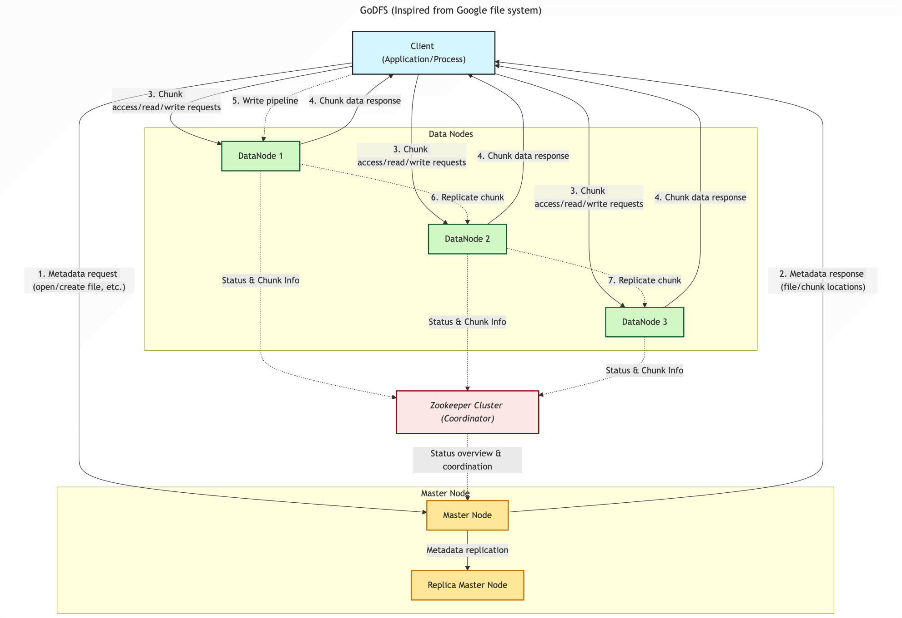

# GoDFS (Distributed File System)


GoDFS is a distributed file system inspired by the Google File System (GFS) and implemented in Go.

It uses Apache ZooKeeper for coordination, health monitoring, and primary-chunk election to ensure consistency, reliability, and fault tolerance across distributed nodes.


## Features


### Distributed Storage


* Files are split into chunks and replicated across multiple DataNodes.

* Chunk size, replication factor, and placement strategy are configurable.


### ZooKeeper-Based Coordination


* Maintains cluster metadata and coordination logic.

* Handles:

* DataNode health tracking

* Monitors whether nodes are alive through ZooKeeper ephemeral nodes.

* Primary chunk server election

* During chunk mutations (write/append), ZooKeeper determines a primary DataNode for the chunk.


### Fault Tolerance

* DataNodes automatically re-register with ZooKeeper.

* Failed nodes trigger re-replication or primary reassignment.

### Strong Consistency for Mutations

* Write operations follow the GFS primary-secondary replication model.

* Mutations are coordinated through the primary DataNode elected via ZooKeeper.

### Simple Architecture

* Metadata operations handled by Master.

* Storage and replication handled by distributed DataNodes.

* ZooKeeper centralizes coordination without becoming a performance bottleneck.


## How ZooKeeper Is Used


### 1. DataNode Health Tracking

* Each DataNode creates an ephemeral znode upon startup.

* If it dies or disconnects, ZooKeeper automatically removes that node.

* Master watches these znodes to detect failures in real time.

### 2. Primary Chunk Server Election

* For each chunk mutation:

* The master elects a primary DataNode via a ZooKeeper lock or sequential znode.

* All other replicas become secondaries.

* The primary coordinates the write order for strong consistency.


## Architecture Diagram




## Running Project in Local Machine

Run [docker-compose](docker-compose-local-test.yml) file here to create the cluster.


## Client Usage Examples

```

godfs create / filename.txt


godfs update /path/filename.txt /path/to/chunk


godfs delete /path/filename.txt


godfs get /path/filename

```